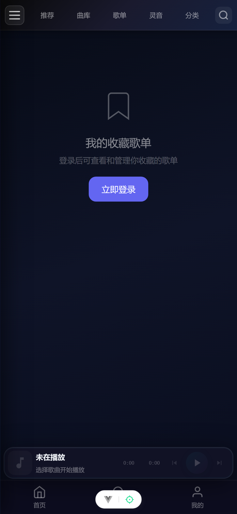
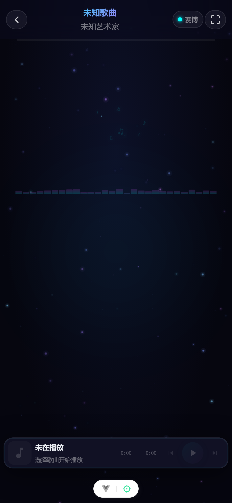

# 🎵 kin_music

> 一个现代化的在线音乐平台，集音乐播放、社交互动、AI 音轨生成于一体。

<div align="center">


</div>

---

## 🌐 在线体验

> 🚀 **已部署上线**：[http://65.52.186.97/recommend](http://65.52.186.97/recommend)

点击上方链接即可在线体验，无需本地搭建。

---

## ✨ 功能特性

### 🎧 核心音乐体验

| 功能 | 说明 |
|------|------|
| **推荐流** | 个性化音乐推荐，发现好音乐 |
| **曲库浏览** | 海量音乐库，支持搜索音乐、歌手、专辑 |
| **歌单广场** | 浏览和收藏公开歌单 |
| **在线播放** | 支持顺序播放、单曲循环、随机播放三种模式 |
| **歌词展示** | 全屏沉浸式歌词体验 |
| **收藏管理** | 我喜欢的音乐 + 收藏歌单管理 |

### 👥 社交与互动

| 功能 | 说明 |
|------|------|
| **用户系统** | 注册 / 登录 / 个人中心 / 头像设置 |
| **关注动态** | 关注用户，查看好友音乐动态 |
| **实时聊天** | 基于 WebSocket (STOMP) 的即时通讯 |
| **音乐评论** | 对歌曲发表评论和互动 |

### 🤖 AI 智能功能

| 功能 | 说明 |
|------|------|
| **AI 音轨生成** | 输入描述词，AI 自动生成音乐轨道 |
| **音轨历史** | 查看和管理生成的 AI 音轨记录 |

### 📤 内容贡献

| 功能 | 说明 |
|------|------|
| **上传歌曲** | 用户自主上传音乐内容 |
| **歌单编辑** | 创建和编辑个性化歌单 |

---

## 🏗️ 技术架构

```
┌─────────────────────────────────────────────────────┐
│                    前端 (kin_music)                   │
│  Vue 3 + Vite 7 + Pinia 3 + Vue Router 4            │
│  Axios + SockJS + STOMP.js                          │
└─────────────────┬───────────────────────────────────┘
                  │  HTTP / WebSocket
                  │  /api → localhost:5210
                  ▼
┌─────────────────────────────────────────────────────┐
│                 后端 API 服务                         │
│           Spring Boot (localhost:5210)               │
└─────────────────────────────────────────────────────┘
```

### 前端技术栈

- **框架**: Vue 3.5+ (Composition API + Options API)
- **构建工具**: Vite 7
- **状态管理**: Pinia 3
- **路由**: Vue Router 4
- **HTTP 客户端**: Axios 1.11
- **实时通信**: SockJS + STOMP.js (WebSocket)
- **代码规范**: ESLint 9 + Prettier 3

---

## 📂 项目结构

```
kin-app/
├── public/                    # 静态资源
├── src/
│   ├── api/                   # API 接口层
│   │   ├── music.js           #   音乐相关接口
│   │   ├── user.js            #   用户相关接口
│   │   ├── playlist.js        #   歌单相关接口
│   │   ├── comment.js         #   评论相关接口
│   │   ├── chat.js            #   聊天相关接口
│   │   └── aitrack.js         #   AI 音轨接口
│   ├── assets/                # 全局样式
│   ├── components/            # 通用组件
│   │   ├── AudioPlayer.vue    #   音频播放器
│   │   ├── MusicList.vue      #   音乐列表
│   │   ├── AuthModal.vue      #   登录/注册弹窗
│   │   ├── Toast.vue          #   提示消息
│   │   ├── ConfirmDialog.vue  #   确认对话框
│   │   └── ...
│   ├── router/                # 路由配置
│   │   └── index.js
│   ├── stores/                # Pinia 状态管理
│   │   ├── user.js            #   用户状态
│   │   └── audio.js           #   音频播放器状态
│   ├── utils/                 # 工具函数
│   │   └── request.js         #   Axios 请求封装
│   ├── views/                 # 页面视图
│   │   ├── RecommendView.vue  #   推荐页
│   │   ├── SelectedView.vue   #   曲库页
│   │   ├── LikeView.vue       #   我喜欢的音乐
│   │   ├── CollectView.vue    #   我的收藏歌单
│   │   ├── PlaylistView.vue   #   歌单详情
│   │   ├── LyricsView.vue     #   歌词页
│   │   ├── AITrackView.vue    #   AI 音轨
│   │   ├── UploadView.vue     #   上传歌曲
│   │   ├── MessageView.vue    #   聊天消息
│   │   ├── DynamicView.vue    #   关注动态
│   │   ├── ProfileView.vue    #   个人中心
│   │   └── ...
│   ├── App.vue                # 根组件
│   └── main.js                # 应用入口
├── index.html                 # HTML 模板
├── vite.config.js             # Vite 配置
├── package.json
└── pnpm-lock.yaml
```

---

## 🚀 快速开始

### 环境要求

- **Node.js**: `^20.19.0 || >=22.12.0`
- **包管理器**: pnpm (推荐)

### 安装依赖

```sh
pnpm install
```

### 启动开发服务器

```sh
pnpm dev
```

开发服务器默认运行在 `http://localhost:5173`，API 请求自动代理到 `http://localhost:5210`。

### 构建生产版本

```sh
pnpm build
```

### 预览生产构建

```sh
pnpm preview
```

### 代码检查与格式化

```sh
pnpm lint      # ESLint 检查并自动修复
pnpm format    # Prettier 格式化
```

---

## 🔧 配置

### 代理配置

API 代理配置位于 `vite.config.js`：

```js
server: {
  proxy: {
    '/api': {
      target: 'http://localhost:5210',
      changeOrigin: true,
      rewrite: (path) => path.replace(/^\/api/, ''),
    },
  },
}
```

### 环境变量

| 文件 | 用途 |
|------|------|
| `.env.development` | 开发环境配置 |
| `.env.production` | 生产环境配置 |

---

## 📸 运行截图

> 以下为部署站（[65.52.186.97](http://65.52.186.97)）移动端（iPhone 14 Pro）实际运行效果

<div align="center">

| 推荐流 | 曲库浏览 | 歌单广场 |
|:---:|:---:|:---:|
| | | |


| AI 音轨 | 上传歌曲 | 个人中心 |
|:---:|:---:|:---:|
||
||

| 我的收藏 | 沉浸式歌词 |
|:---:|:---:|
|  |  |

</div>

---

## 📱 页面路由

| 路径 | 页面 | 说明 |
|------|------|------|
| `/recommend` | 推荐 | 默认首页，音乐推荐流 |
| `/selected` | 曲库 | 音乐搜索与浏览 |
| `/like` | 我喜欢的音乐 | 个人收藏音乐 |
| `/collect` | 我的收藏歌单 | 个人收藏歌单 |
| `/playlist-square` | 歌单广场 | 公开歌单浏览 |
| `/playlist/:id` | 歌单详情 | 查看歌单内容 |
| `/playlist/:id/edit` | 编辑歌单 | 编辑歌单信息 |
| `/lyrics/:id` | 歌词 | 全屏歌词显示 |
| `/ai-track` | AI 音轨 | AI 音乐生成 |
| `/upload` | 上传歌曲 | 内容贡献 |
| `/Dynamic` | 动态 | 关注用户动态 |
| `/follow-list` | 关注列表 | 关注/粉丝管理 |
| `/profile` | 个人中心 | 用户信息管理 |
| `/message/:userId` | 聊天 | 即时通讯（需登录） |

---

## 🎨 UI 设计

采用深色主题配合青色 (#00ffff) 点缀色，侧边栏 + 顶部导航 + 主内容区的经典布局：

- **侧边栏**: 200px 固定宽度，渐变色背景
- **顶部导航**: 60px 高度，包含搜索框和用户菜单
- **底部播放器**: 固定在底部，支持滑动过渡动画
- **响应式**: 适配移动端布局

---

## 📄 License

MIT

---

<div align="center">
  <sub>Built with ❤️ using Vue 3 + Vite</sub>
</div>
